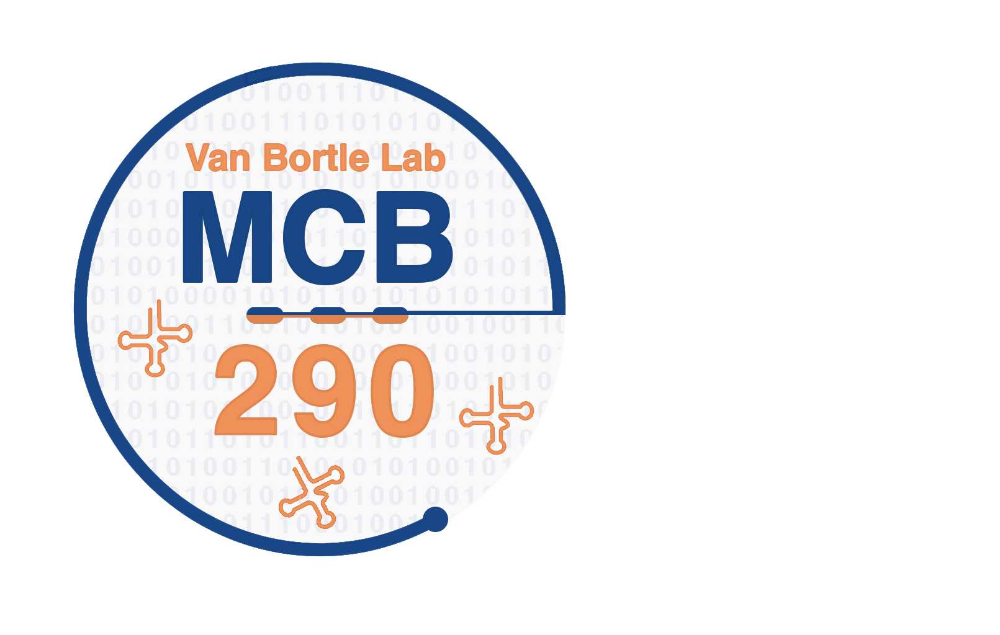

 # 

## MCB290 Undergraduate Research Projects (Overview)

**What does MCB290 look like in the Van Bortle lab?** We are a data-driven genomics lab primarily interested in understanding RNA polymerase III (Pol III) transcription regulation, including mechanisms of Pol III overactivity in cancer. As Pol III produces many classes of small noncoding RNAs integral to translation and protein synthesis, *including tRNAs,* increased levels of Pol III transcription are thought to promote growth-related phenotypes. Undergraduate research projects are built around developing proficiency in common data analysis and visualization techniques, and applying these skills to biological questions centered on tRNA dynamics in tissues and tumors. 

Undergraduate research projects will require (1) programming in R, (2) the use of publicly available datasets (e.g. TCGA, ENCODE, etc.), and (3) common tools and analytical frameworks for high-throughput data analysis. This repository is therefore intended to serve as a hub for onboarding, materials, and relevant resources.

## MCB290 Learning Objectives

As an undergraduate researcher on our team, you will: 
- Gain a deeper understanding of **basic mechanisms of gene regulation** and transcription
- Develop proficiency in **programming, data analysis, and basic statistical approaches**. 
- Apply critical thinking to the **interpretation of molecular, biochemical, and genomic data**

Undergraduate students interested in graduating with **Distinction in MCB** are expected to follow the guidelines provided (here)[https://mcb.illinois.edu/academics/undergraduate-programs/major-molecular-cellular-biology/graduation-distinction-mcb]. In addition to the objectives above, students seeking distinction are expected to make progress on an independent thesis project. 

